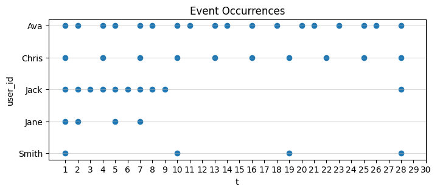

# clumpi [klˈʌmpάɪ]

[](https://pypi.org/project/clumpi/)
[](https://doi.org/10.5281/zenodo.15202295)


## Overview
A simple python package to calculate Clumpiness for RMFC analysis by Zhang, Bradlow & Small (2015).
Easy use with `clumpi.get_RFC()`

## Requirements
- Python
- pandas
- numpy
- matplotlib

works well with Google Colab.

## Installation
Simply use ```pip install``` for install this from PyPI:
```bash
pip install clumpi
```
or you can from Git repo:
```bash
pip install git+https://github.com/jniimi/clumpi.git
```
(perhaps, git repo version may be newer.)

## Dataset
Use your discrete time-series event data with ID and time. 
- Create DataFrame that records only the point in time when the event occurred in the time series data. 
- The name of the variables can be anything.

| user_id | t       |
|:--------|--------:|
| Ava     | 1       |
| Ava     | 4       |
| ...     | ...     |
| Jack    | 3       |
| Jack    | 10      |
| ...     | ...     |

Check out our sample dataset for further details.
```python
df = clumpi.load_sample_data()
display(df)
```


## Usage
### Log to Clumpiness
Use the function `clumpi.get_RFC()` to calculate. Specify following arguments.
- `id`: a column name indicating user
- `t`: a column name indicating discrete time (e.g., a day in a month), **t starts from 1 (Not 0)**.
- `N`: a maximum number of events during the period (e.g., # of days in a month)
- `M` (optional): a number of iterations for the simulation to calculate threshold (3000 for default)
- `alpha` (optional): a significance level for the test of regularity (0.05 for default)
- `plot` (optional): bool whether plot the frequency by users

  By specifying the argument `plot`=True, then the function displays the following scatter plot.


### Simply Calculate H0
Use the function `clumpi.calc_threshold()` to calculate upper `alpha` % point in `M` times simulation. 

All you need to specify are `N`, `M`, and `alpha` (See `clumpi.get_RFC`).

# Acknoledgement
The simulation in this package is based on Appendix B by Zhang et al. (2015).

Zhang, Y., Bradlow, E. T., & Small, D. S. (2015). Predicting customer value using clumpiness: From RFM to RFMC. Marketing Science, 34(2), 195-208.
https://doi.org/10.1287/mksc.2014.0873

# Author and Citation
jniimi ([@JvckAndersen](https://x.com/JvckAndersen))

```
@misc{niimi2024clumpi,
  author = {Junichiro Niimi},
  title = {clumpi: A Python package for calculating Clumpiness in RFMC analysis},
  year = {2024},
  publisher = {Zenodo},
  doi = {10.5281/zenodo.15202295},
  url = {https://github.com/jniimi/clumpi}
}
```
