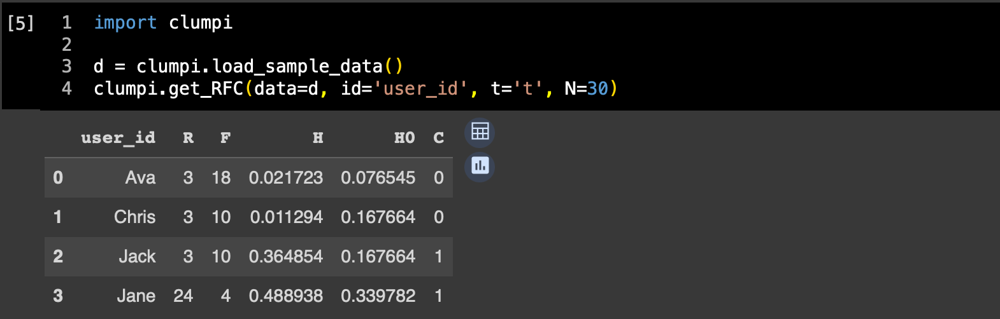
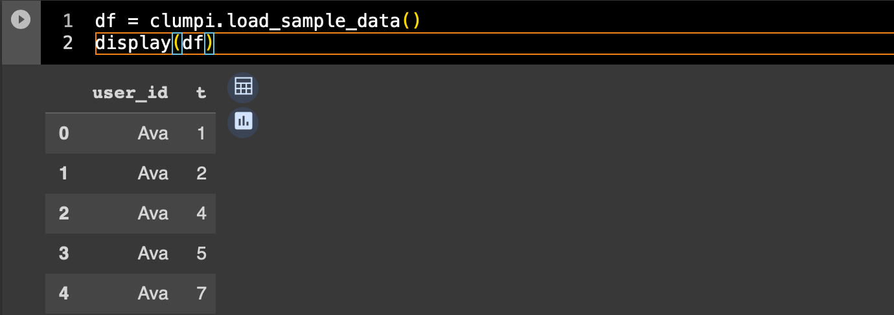

# clumpi [klˈʌmpάɪ]

## Overview
A simple python package to calculate Clumpiness for RMFC analysis by Zhang, Bradlow & Small (2015).
Easy use with `clumpi.get_RFC()`

## Requirements
- Python
- pandas
- numpy

works well with Google Colab.

## Installation
```bash
pip install git+https://github.com/jniimi/clumpi.git
```
## Dataset
Use your time-series event data with ID and time. 
- Create DataFrame that records only the point in time when the event occurred in the time series data. 
- The name of the variables can be anything.

| user_id | t       |
|:--------|--------:|
| Ava     | 1       |
| Ava     | 4       |
| ...     | ...     |
| Jack    | 3       |
| Jack    | 10      |
| ...     | ...     |

Check out our sample dataset for further details.
```python
df = clumpi.load_sample_data()
display(df)
```


## Usage
### Log to Clumpiness
Use the function `clumpi.get_RFC()` to calculate. Specify following information for the arguments.
- `id`: a var name in df indicating user
- `t`: a var name in df indicating time
- `N`: total number of events can occur during the period
- `M` (optional): a number of iterations for the simulation to calculate threshold (3000 for default)
- `alpha` (optional): significance probability for the test of regularity (0.05 for default)

### Simply Calculate H0
Use the function `clumpi.calc_threshold()` to calculate upper `alpha` % point in `M` times simulation. 

All you need to specify are `N`, `M`, and `alpha` (See `clumpi.get_RFC`).

# Acknoledgement
The simulation in this package is based on Appendix B by Zhang et al. (2015).

Zhang, Y., Bradlow, E. T., & Small, D. S. (2015). Predicting customer value using clumpiness: From RFM to RFMC. Marketing Science, 34(2), 195-208.
https://doi.org/10.1287/mksc.2014.0873

# Author
jniimi ([@JvckAndersen](https://twitter.com/JvckAndersen))